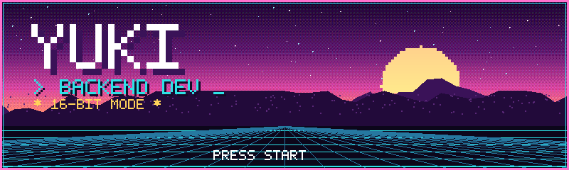

<div align="center">
  
</div>

<h1 align="center">ADRIEL PEREIRA</h1>
<h3 align="center">Backend Developer — C# · .NET · DevSecOps</h3>

<p align="center">
  
  
  
  
</p>

```
┌─[ ~/hxllzin ]────────────────────────────────────────┐
│ $ whoami                                             │
│ > adriel pereira · backend · security-first · APIs   │
│ $ cat stack.txt                                      │
│ > C# · .NET · PostgreSQL · Docker · Kafka            │
│ $ uptime                                             │
│ > building since 2024 · Mesquita/RJ · Brazil         │
└──────────────────────────────────────────────────────┘
```

Backend developer focused on C# and .NET, with hands-on experience in APIs,
distributed services, automated testing, Docker, databases, DevSecOps and AI
coding agents (OpenAI Codex, Claude Code).

## TECHNICAL PROFICIENCY

```
C#           ▓▓▓▓▓▓▓▓▓▓▓▓▓░
.NET         ▓▓▓▓▓▓▓▓▓▓▓▓▓░
ASP.NET Core ▓▓▓▓▓▓▓▓▓▓▓▓░░
PostgreSQL   ▓▓▓▓▓▓▓▓▓▓▓░░░
Docker       ▓▓▓▓▓▓▓▓▓▓░░░░
DevSecOps    ▓▓▓▓▓▓▓▓▓░░░░░
Kafka        ▓▓▓▓▓▓▓▓░░░░░░
```

## TECH STACK

<p align="center">
  
  
  
  
  
  
  
  
  
</p>

## FEATURED PROJECTS

| Project | Description |
|---|---|
| **SentinelFlow** | DevSecOps platform built with ASP.NET Core/.NET — pipeline orchestration, finding normalization, merge policies, remediation SLAs and risk exceptions |
| **Secure SaaS Lab** | AppSec laboratory comparing vulnerable vs. secure environments — MFA, rate limiting, CSRF, RBAC and audit trails |
| **HXLLDEV Store** | Distributed commerce simulation — Orders Service with Minimal API, Kafka, PostgreSQL, Docker, Saga orchestration and Event Sourcing |
| **HXLLGRAVE** | Swift project built with AI coding agents (OpenAI Codex) integrated into the implementation workflow |

## SECURITY TOOLING

```
MFA · RBAC · Rate Limiting · CSRF · HttpOnly Cookies · Audit Trails
CodeQL · Semgrep · Gitleaks · Trivy · SBOM
```

## GITHUB STATS

<p align="center">
  
  
</p>

<p align="center">
  
</p>

<!-- CONTRIBUTION SNAKE (optional — generate with Platane/snk):
<picture>
  <source media="(prefers-color-scheme: dark)" srcset="https://raw.githubusercontent.com/hxllzindev/hxllzindev/output/github-snake-dark.svg" />
  <source media="(prefers-color-scheme: light)" srcset="https://raw.githubusercontent.com/hxllzindev/hxllzindev/output/github-snake.svg" />
  
</picture>
-->

## EDUCATION & CERTIFICATIONS

- **Estácio (UNESA)** — System Analysis and Development · 2024–2027
- **Certifications:** Advanced Back-End with .NET · Back-End with .NET and C# · C# Fundamentals · Databases · Docker · Data Analytics on AWS · Cyber Threat Management · Introduction to Pentesting

## GET IN TOUCH

<p align="center">
  <a href="https://www.linkedin.com/in/hxlldev/"></a>
  <a href="mailto:adriel.p@icloud.com"></a>
</p>
